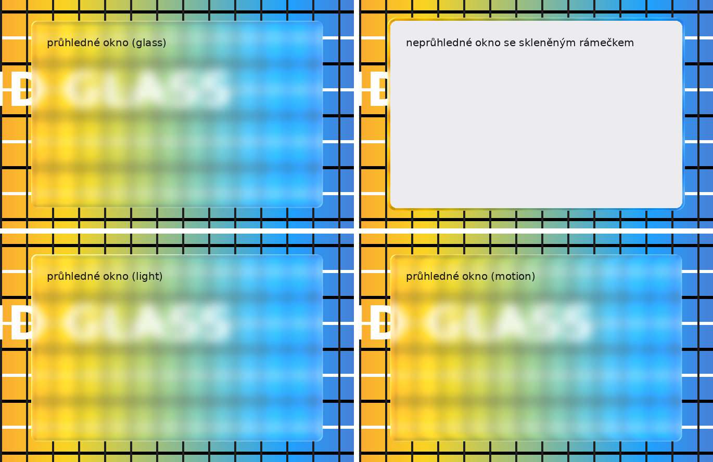

# Liquid Glass for KDE Plasma 6 (Arch Linux)

*[Česká verze](README.cs.md)*

A "liquid glass" look like the new macOS/iOS: the background behind translucent
windows, panels and menus is blurred, **refracted at the edges like a lens**,
the edge has a **specular highlight** that **follows the cursor**, and the glass
**sloshes with inertia and ripples** while a window is moved. Normal (opaque)
windows get a thin **glass rim**, so the glass is visible around every app,
GTK apps included. The rim and the window borders can also be **dragged to
move the window**.



*The preview is rendered by the same shader over a test image
(`tools/preview.py`), not a screenshot of a real desktop.* Top left: a
translucent window; top right: an opaque window with a glass rim; bottom left:
the cursor highlight; bottom right: inertia while the window moves.

## What's inside

| Part | What it does |
|---|---|
| `effect/` | KWin effect in C++ and GLSL, a modified copy of the built-in Blur effect from KWin 6.7.5, plus its settings page |
| `kvantum/` | Kvantum theme `LiquidGlass`: translucent windows and menus for Qt/KDE apps (based on KvMojaveLight or KvMojave) |
| `install.sh` | packages, build, enabling, app style, backup/restore, uninstall |
| `liquid-glass` | command-line settings tool |
| `tools/preview.py` | shader preview without KWin (for tuning the look) |

## Installation

```bash
./install.sh --dry-run     # first see what will happen
./install.sh               # install (asks for sudo when needed)
./install.sh --dark        # dark variant
```

The script:
0. **Backs up the current look** to `~/liquid-glass-backups/` (see below).
1. Installs packages: `base-devel cmake extra-cmake-modules kwin qt6-base kconfig kcmutils kvantum …`.
2. Builds the effect and installs it into `/usr/lib/qt6/plugins/kwin/effects/`.
3. Disables the built-in *Blur* effect and enables *Liquid Glass*.
4. Creates the Kvantum theme `LiquidGlass` and sets it as the app style.
5. After asking, makes panels floating and translucent (restarts the panel).
6. Adds a pacman hook that reminds you to rebuild after a KWin update.

Original values are saved in `~/.local/share/liquid-glass/state.env` and
`./install.sh --uninstall` restores them.

Parts can be run separately: `./install.sh --only effect`, `--only kvantum`,
`--only panel`.

### Backing up and restoring the look

Before every installation a backup
`~/liquid-glass-backups/backup-DATE-before-install.tar.gz` is created. It
contains the look settings: `kwinrc`, `kdeglobals`, `plasmarc`,
`plasmashellrc`, the desktop and panel layout, Kvantum, Breeze/Klassy
decorations, Konsole profiles, GTK settings and user themes, colors and icons
in `~/.local/share`. `LIQUID-GLASS-BACKUP.txt` inside records which theme was
set.

```bash
./install.sh --backup                 # back up manually at any time
./install.sh --list-backups           # list backups
./install.sh --restore                # restore the latest backup
./install.sh --restore ~/liquid-glass-backups/backup-….tar.gz
```

A restore first backs up the current state (`…-before-restore`), so it can be
undone. Only files from the look list are restored, nothing else. Backups made
by the older Czech version in `~/liquid-glass-zalohy/` are found too. Log out
and back in after a restore.

### After a KWin update

KWin only loads an effect built for exactly its version. After a Plasma update
the glass disappears, but nothing breaks. To bring it back:

```bash
./install.sh --rebuild
```

Then log out and back in.

## Settings

**GUI:** *System Settings → Window Management → Desktop Effects → Liquid Glass
→ gear icon.* It has all the values below in tabs (Glass, Rim, Animation, Apps),
presets (iPhone, Subtle, Strong…) and the window and menu translucency of the
Kvantum theme. *Apply* saves and applies the changes immediately.

**Command line:**

```bash
liquid-glass show                  # current values
liquid-glass preset iphone         # iphone | subtle | default | strong | no-ring | dark | light
liquid-glass set Refraction 28     # one value, applied immediately
liquid-glass off / on              # back to the built-in Blur / enable the glass
```

| Key | Default | Meaning |
|---|---|---|
| `BlurStrength` | 10 | blur strength (1–15) |
| `Saturation` | 160 | color saturation behind the glass (%) |
| `NoiseStrength` | 3 | subtle noise against banding |
| `Refraction` | 20 | how many px the background "bends" at the edge |
| `EdgeWidth` | 26 | width of the band along the edge where light refracts (px) |
| `ChromaticAberration` | 35 | color dispersion at the edge (0–100) |
| `Specular` | 55 | highlight strength (0–100) |
| `TintStrength` / `DarkTint` | 8 / false | frosted (light) or smoky (dark) tint |
| `RingWidth` | 6 | glass rim around normal windows (px, 0 = off) |
| `RingClarity` | 70 | how clear the rim is (0 = frosted, 100 = almost sharp background) |
| `WaveStrength` | 60 | ripples of the background under the glass while moving a window (0 = off) |
| `BorderMoves` | true | dragging a window border (not a corner) or the glass rim **moves** the window instead of resizing; corners still resize |
| `RingExcludeClasses` | – | windows without a rim, e.g. `steam,firefox` |
| `ForceGlassClasses` | – | glass behind the whole window for these apps (only useful for translucent ones) |
| `CornerRadius` | 10 | corner radius when the window does not report one |
| `MouseLight` | true | the highlight follows the cursor |
| `LiquidMotion` / `MotionStrength` | true / 50 | glass inertia while moving a window |
| `IdleShimmer` | false | the light slowly "breathes" (repaints continuously, uses more power) |

The values live in `~/.config/kwinrc`, group `[Effect-liquidglass]`.

### Tips

- **Konsole:** in the profile, *Appearance → color scheme → Edit…*, set
  *Background transparency* to 15–25 % and enable *Blur background*. Konsole
  then requests the glass itself.
- **Firefox, Chrome, GTK apps** paint their own opaque background, so there is
  no glass inside the window, but they get the glass rim.
- **Firefox toolbars** can be made translucent with `userChrome.css`
  (`toolkit.legacyUserProfileCustomizations.stylesheets` and
  `browser.tabs.allow_transparent_browser` in `about:config`) plus
  `liquid-glass set ForceGlassClasses firefox`.
- **Readability:** if text on the glass is hard to read, raise `BlurStrength` or
  `TintStrength`, or lower the window translucency in the settings (Apps tab).
- **Shadows:** the rim lies under the window shadow. For a stronger glass look,
  make the shadow smaller in the window decoration settings.
- **Moving windows:** besides the border and rim, Meta + drag anywhere in a
  window moves it (KDE default).

## Troubleshooting

| Problem | What to try |
|---|---|
| `liquid-glass status` says the effect is not running | log out and back in; after a KWin update `./install.sh --rebuild` |
| `liquid-glass: command not found` | `~/.local/bin` is not in `PATH`: `source ~/.bashrc` or open a new terminal |
| build fails (error in `liquidglass.cpp`) | KWin is a different version than the effect was written for (6.7); see below |
| the glass flickers or things feel slow | `liquid-glass preset no-ring`, `IdleShimmer false`, lower `BlurStrength` |
| nothing helps | `liquid-glass off` goes back to the built-in Blur |

Effect logs:
```bash
journalctl --user -b | grep -i liquidglass
```

## How it works

The effect is based on KWin's built-in Blur (dual Kawase algorithm). The last
pass, which draws to the screen, is replaced (`effect/src/shaders/glass.frag`):

- **Refraction:** the distance from the rounded edge comes from a signed
  distance field (`sdfRoundedBox`). In a band along the edge the background is
  read shifted along the edge normal, so content from beyond the edge "bends"
  into the glass.
- **Dispersion:** the red and blue channels are read with slightly different
  offsets.
- **Specular:** a thin light line on the edge lit from the top left, plus a
  highlight that grows near the cursor.
- **Inertia and ripples:** when a window moves, a motion vector shifts the
  background reading against the movement and two travelling waves ripple it;
  both fade out after the window stops.
- **Rim around the window:** a band of `RingWidth` around the window frame is
  added to the glass area and drawn with the sharp background for a clear look.
  The background is captured with an extra margin so the refraction has
  something to read.
- **Moving by the border or rim:** an input filter inside KWin catches left
  clicks on a decoration edge or on the rim and starts moving the window.

The shader can be tuned without KWin:

```bash
pip install moderngl pillow numpy
python3 tools/preview.py --refraction 28 --chroma 0.6
```

## Status and limitations

- Built and checked against the **KWin 6.7.5** headers. The shader compiles and
  renders (Mesa, GLSL 1.40). Installation and uninstallation were tested for
  real in a container with pacman stubbed out.
- Plasma 6.8 and newer: the KWin API changes between versions. If the effect
  does not build, it needs to be adapted to `src/plugins/blur` of that KWin
  version (changes are usually small).
- The panel settings (`panelOpacity`, `floating` in `plasmashellrc`) follow
  current Plasma. If they do not take effect, set the panel up manually in edit
  mode.
- Dragging the border or rim to move a window works on Wayland only. Over a
  border the cursor still shows resize arrows (drawn by the decoration).
- The effect works on X11 but is tuned for Wayland.

## License

GPL-2.0-or-later. The effect is derived from KWin (© the KWin authors, see the
file headers).
